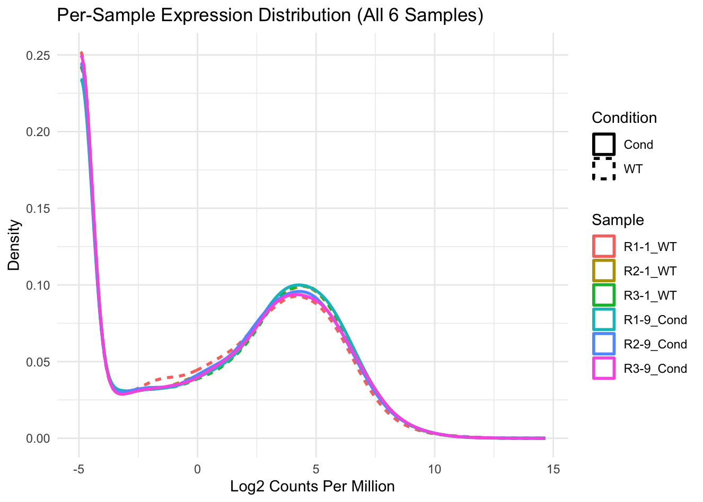

# Differential Analysis (Part 2): Statistical Validation
**Date:** April 8, 2026
**Project:** Plant-Epigenomics-Lab-Log

## Overview
Following the removal of the `R1-1_WT` outlier, extensive statistical validation was performed to confirm the integrity of the 5-sample model. Density plots and P-value distribution histograms were generated to compare the 6-sample and 5-sample datasets. Finally, a Likelihood Ratio Test (LRT) was employed to extract the final Differentially Expressed Genes (DEGs).

## 📊 Visual Validation

### 1. Expression Distribution (Density Plot)
Generated a Log2CPM density plot to visualize the raw expression distribution across all samples.

* **Observation:** `R1-1_WT` (dashed red line) shows a slight but distinct deviation from the baseline in the lower expression ranges (-2 to 2 Log2CPM) compared to all other replicates, providing mathematical backing for its exclusion.

### 2. P-Value Distribution
Compared the raw P-value histograms of the 6-sample vs. 5-sample models. A successful RNA-seq experiment should display a sharp peak near 0 (representing truly differentially expressed genes) followed by a uniform distribution.
.png)
* **Observation:** The 5-sample "Cleaned" model demonstrates a noticeably sharper and higher peak at P < 0.05, confirming increased statistical power after removing the variance introduced by the outlier.

## 🧬 Final DEG Extraction (LRT)
Transitioned from the conservative Quasi-Likelihood (QLF) test to the Likelihood Ratio Test (LRT) to finalize the gene list.
* **Filtering Criteria:** False Discovery Rate (FDR) < 0.05 AND absolute Log2 Fold Change (|logFC|) > 1.
* **Final Result:** Successfully extracted **865** highly significant Differentially Expressed Genes.

```bash
> nrow(final_sig_genes)
[1] 865
```

## 🚨 The Power vs. Purity Trade-off (The 4-Sample Experiment)
To test if a "perfectly clean" dataset would yield an even sharper signal, a secondary exploratory model was fitted using only the 4 most tightly clustered "ideal" samples (`R2-1_WT`, `R3-1_WT`, `R1-9_Cond`, `R2-9_Cond`).

```R
# 4-Sample strict QL Test yielded 0 significant genes
summary(decideTests(qlf_final))
```

* **Observation:** The test yielded **0 Significant DEGs**.
* **Statistical Implication (Degrees of Freedom):** With only 4 total samples across 2 groups, the residual degrees of freedom dropped to 2 ($df = n - 2 = 2$). At this threshold, `edgeR` becomes extremely conservative. Without enough replicates to confidently estimate within-group variance, the algorithm heavily penalizes the P-values to prevent false positives.
* **Conclusion:** The 5-sample model represents the optimal balance. It successfully eliminated the severe technical variance of the initial outlier while maintaining sufficient sample size (3 Cond vs. 2 WT) to preserve statistical power.