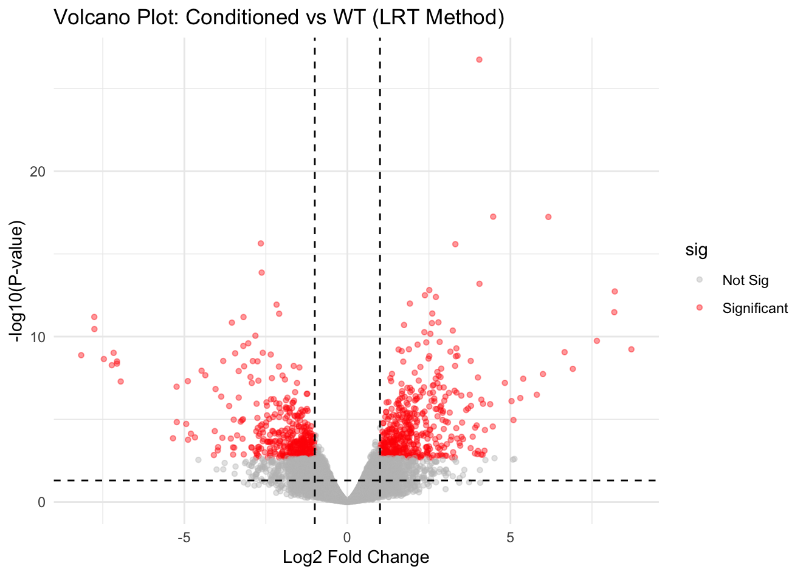
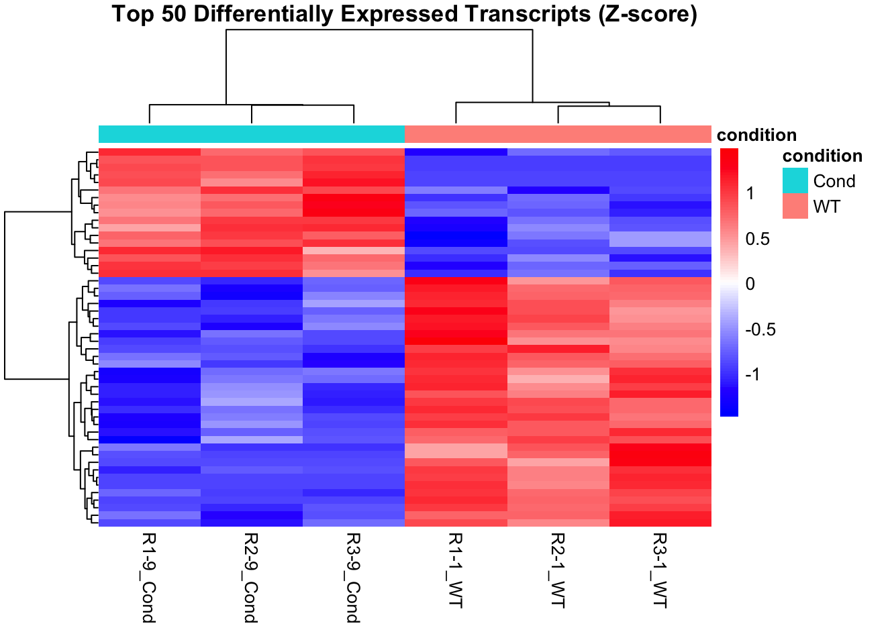

# Phase 5 Visualization: Volcano Plot & Heatmap
**Date:** April 9, 2026
**Project:** Plant-Epigenomics-Lab-Log

## Overview
Executed Phase 5 of the RNA-seq pipeline by generating publication-quality visualizations (`ggplot2` and `pheatmap`). These plots translate the statistical output of the Likelihood Ratio Test (LRT) into clear biological expression signatures, allowing us to visualize the magnitude and clustering of the conditioning response. 

Notably, all 6 original samples were retained for the heatmap visualization to evaluate the behavior of the biological outlier (`R1-1_WT`) specifically within the context of the most significant Differentially Expressed Genes (DEGs).

## 📊 Visualizations

### 1. Volcano Plot (Global Transcriptomic Shift)
The Volcano Plot visualizes the relationship between the magnitude of change (Log2 Fold Change) and statistical significance (-log10 P-value) for every transcript in the dataset.

* **Thresholds:** Dashed lines denote the strict filtering criteria: False Discovery Rate (FDR) < 0.05 and |logFC| > 1.
* **Observation:** The plot shows a robust, symmetric distribution of hundreds of significant transcripts (red dots) pushed far beyond the significance thresholds, indicating a massive transcriptomic reprogramming event in the root tissue upon conditioning.

### 2. Expression Signature Heatmap (Top 50 DEGs)
A Z-score scaled heatmap was generated to observe the relative expression patterns of the Top 50 most significant DEGs across all biological replicates.

* **Z-score Scaling:** Data was row-scaled. Instead of showing absolute counts (which bias towards highly expressed house-keeping genes), the colors represent standard deviations above (red) or below (blue) that specific gene's average expression.
* **Biological Insight (The Outlier):** While `R1-1_WT` was determined to be a global variance outlier during the PCA phase, the hierarchical clustering on this heatmap successfully grouped it within the Wild Type clade. This proves that despite its global technical noise, its expression signature for these specific top 50 conditioning-response genes remains undeniably Wild Type.