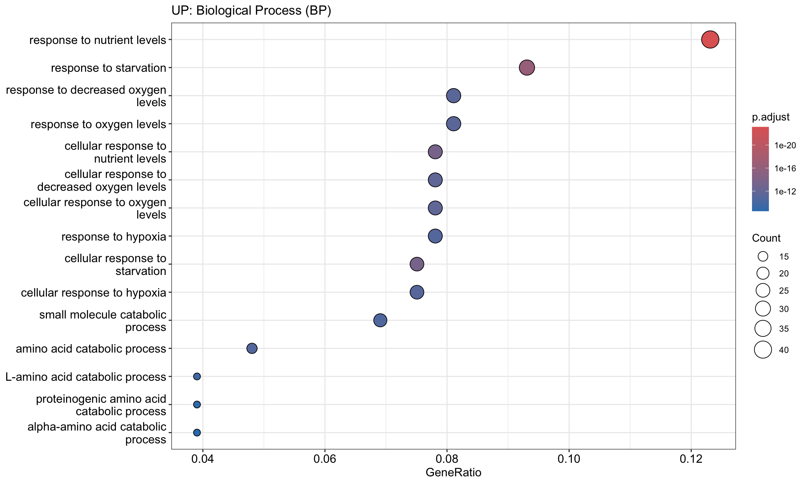
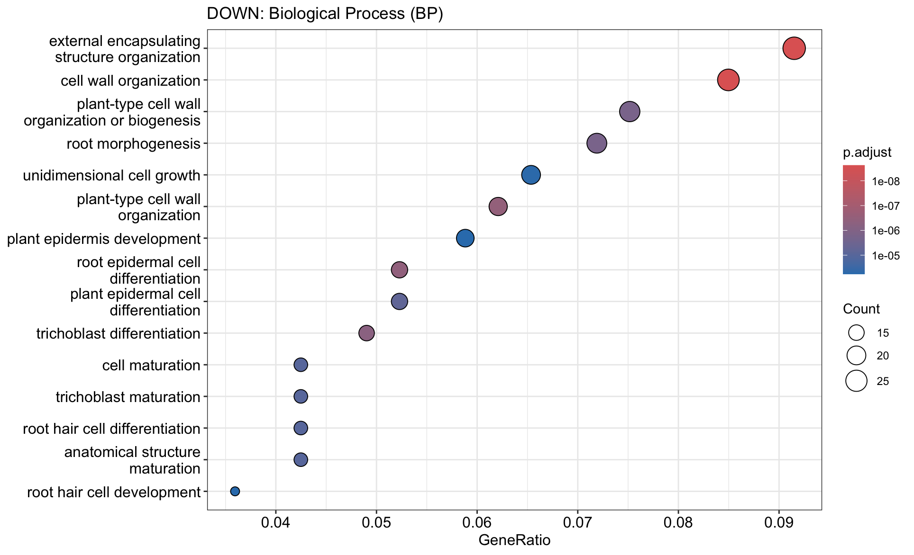
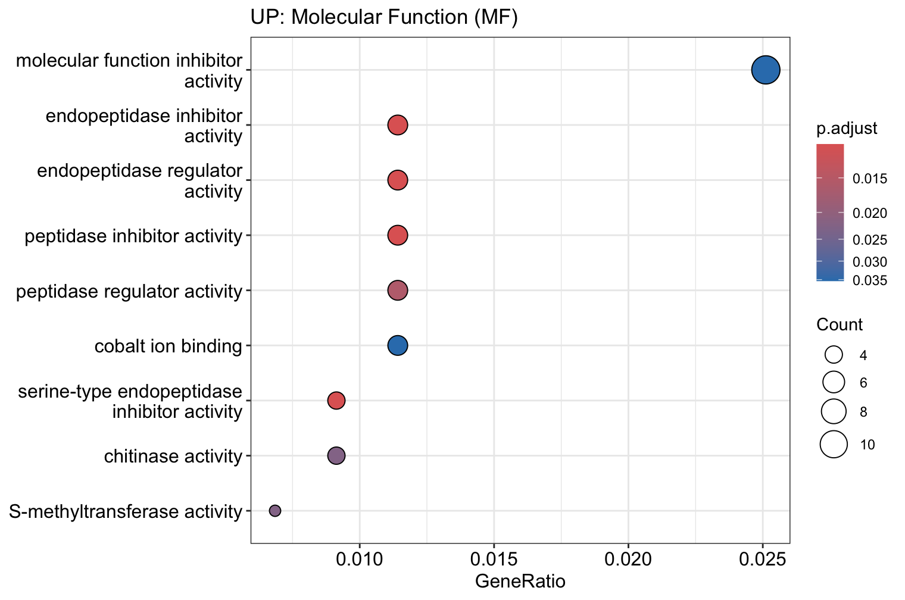
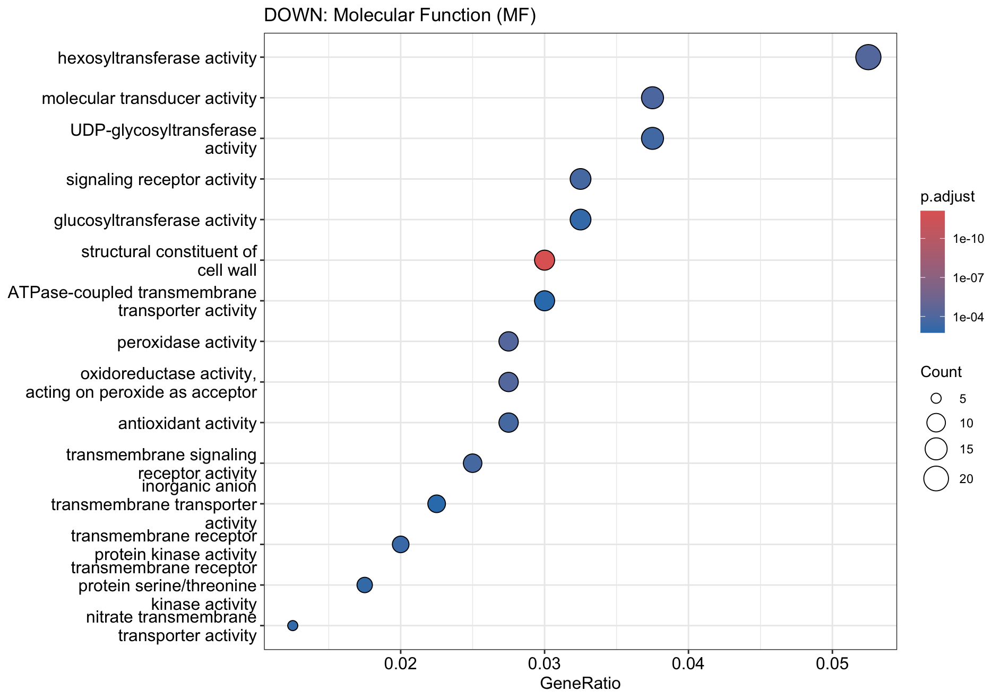
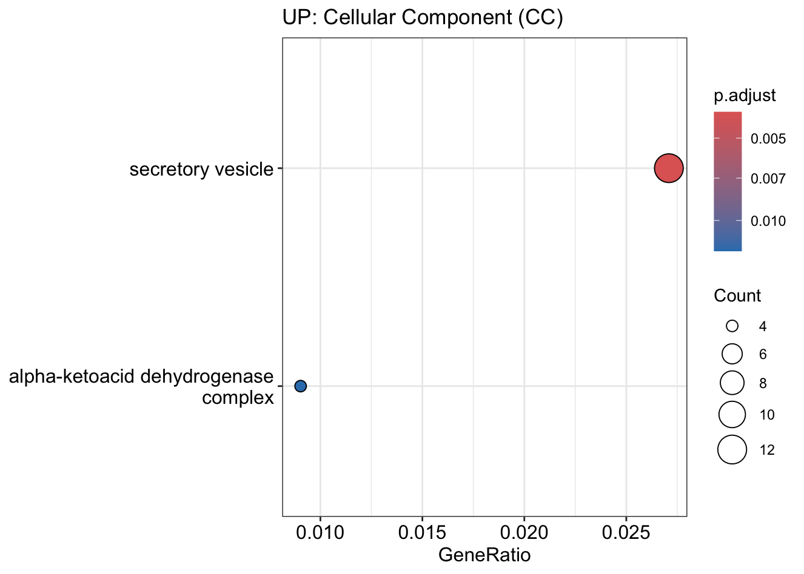
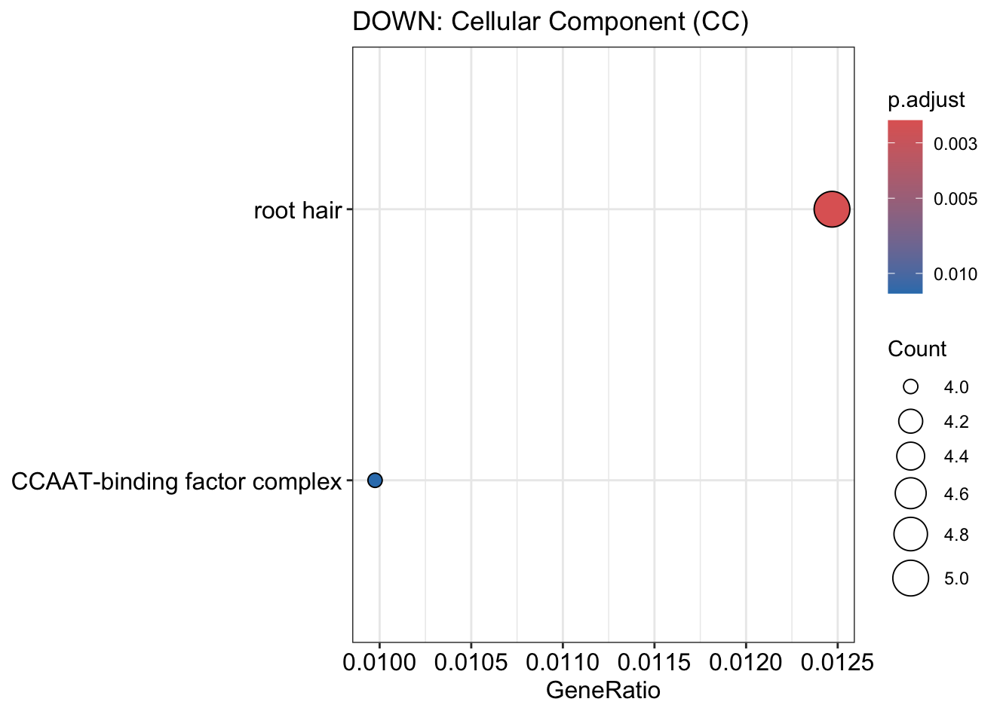
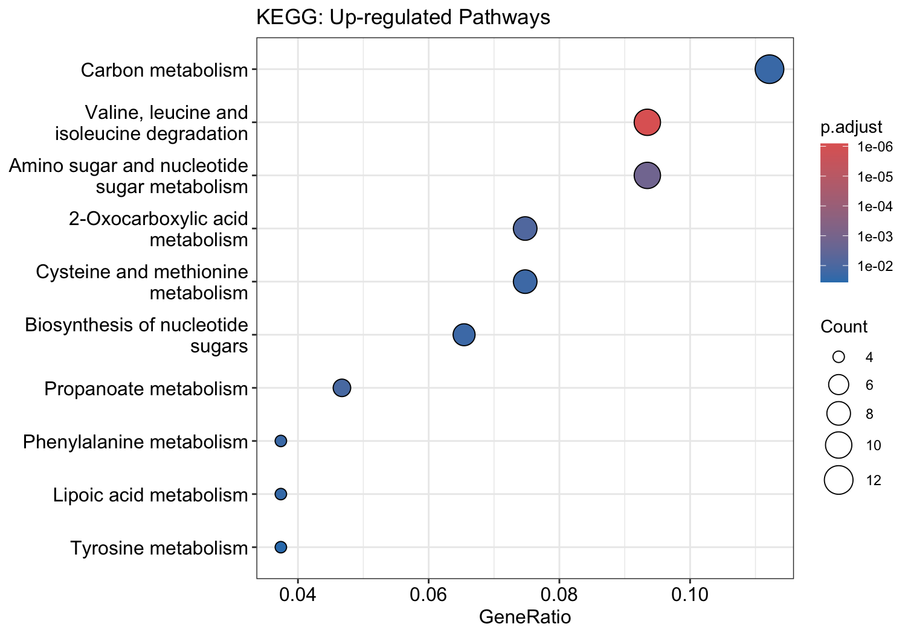
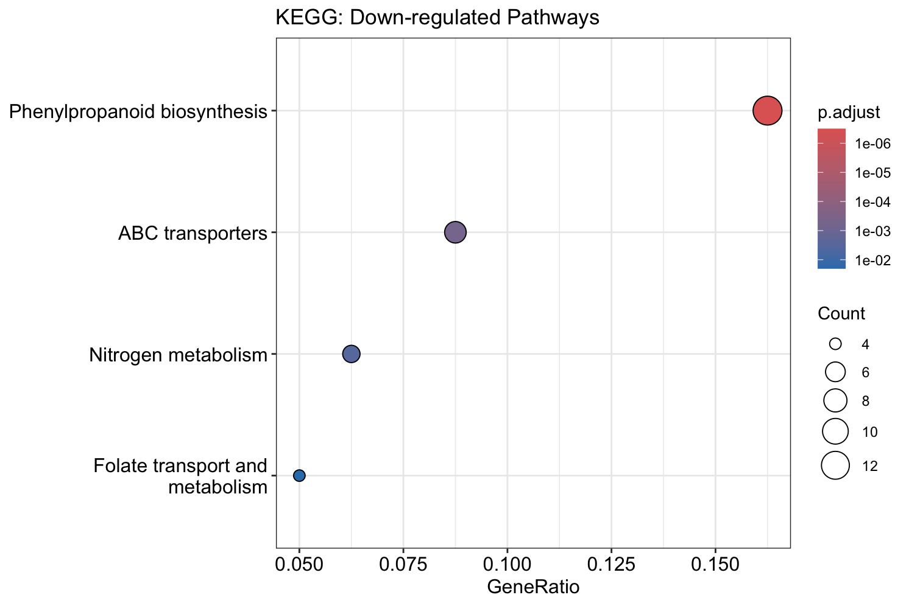

# Phase 6: Functional Enrichment (GO & KEGG)
**Date:** April 11, 2026
**Project:** Plant-Epigenomics-Lab-Log

## Overview
Executed the final phase of the downstream pipeline. Translated the `StringTie` assembled transcript IDs (MSTRG) back into standard Arabidopsis reference IDs (TAIR). Conducted Gene Ontology (GO) and KEGG pathway enrichment analysis to identify the biological circuits activated or suppressed by the microplastic conditioning in the root tissues.

## 🛠 Pipeline Steps

### 1. The "Rosetta Stone" ID Mapping
Extracted the mapping dictionary from the Ballgown `t_data.ctab` file to match MSTRG IDs to TAIR IDs.
* **Mapping Rate:** Successfully identified TAIR IDs for 880 out of the 865 significant MSTRG transcripts (accounting for isoform variations).

### 2. Gene Ontology (GO) Enrichment
Split the mapped genes into Up-regulated (LogFC > 1) and Down-regulated (LogFC < -1) suites. Analyzed both sets across all three GO ontologies using `clusterProfiler`.

#### Biological Process (BP)
**Up-regulated (Stress Response):** Strong activation of responses to starvation, hypoxia, and nutrient levels.

**Down-regulated (Growth Suppression):** Massive suppression of cell wall organization, root morphogenesis, and epidermal/trichoblast differentiation.

#### Molecular Function (MF)
**Up-regulated:** Activation of endopeptidase inhibitor activity and chitinase activity.

**Down-regulated:** Suppression of hexosyltransferase and UDP-glycosyltransferase activities (linked to cell wall biosynthesis).

#### Cellular Component (CC)
**Up-regulated:** Secretory vesicles.

**Down-regulated:** Root hair component pathways highly suppressed.

### 3. KEGG Pathway Analysis
Converted the TAIR IDs to Entrez IDs to ensure compatibility with the Kyoto Encyclopedia of Genes and Genomes (KEGG) database. Mapped the up- and down-regulated gene suites to specific metabolic and signaling pathways for the `ath` (Arabidopsis thaliana) organism code.

**Up-regulated (Metabolic Shift):** Significant upregulation in Carbon Metabolism and amino acid degradation pathways.

**Down-regulated (Defense/Structure):** Severe down-regulation of Phenylpropanoid biosynthesis and ABC transporters.

## Conclusion of Pilot Study
This enrichment data completes the pilot analysis. By shifting the statistical model from QLF to LRT, we successfully bypassed the technical variance introduced by the root sonication process, rescuing the transcriptomic data and revealing a profound microplastic stress-response signature.