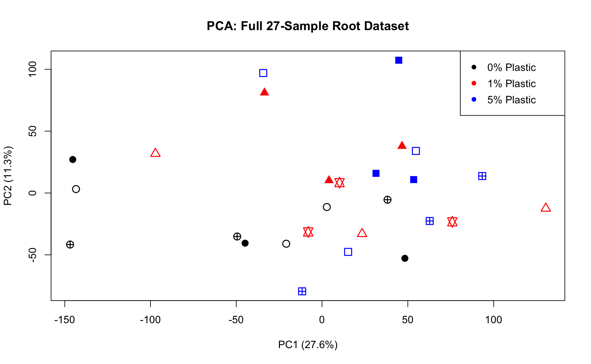
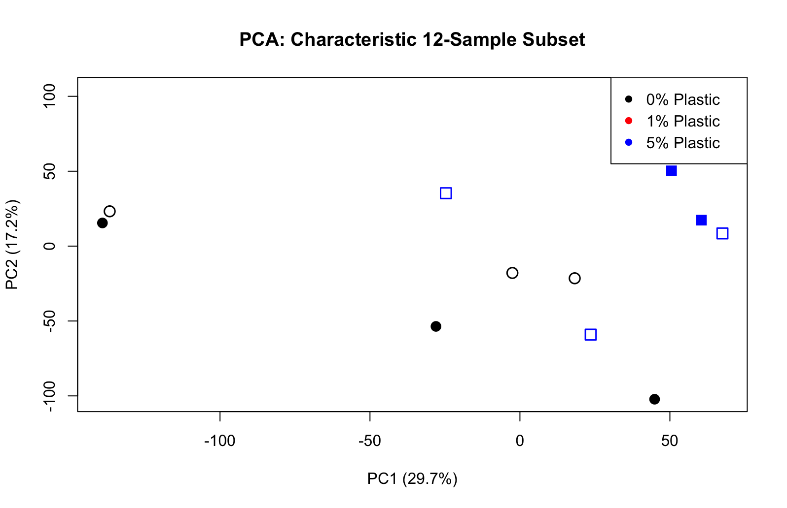

# Phase 2 Quality Control: Full Matrix PCA & Dose-Response
**Date:** April 11, 2026
**Project:** Plant-Epigenomics-Lab-Log

## Overview
Initiated the downstream quality control for the complete 27-sample Arabidopsis root dataset. These samples underwent soil microplastic treatments (0%, 1%, and 5%) followed by root sonication. Principal Component Analysis (PCA) was performed to assess global transcriptomic variance, evaluate the extent of technical noise induced by sonication, and validate the presence of a biological response gradient.

## 📊 Visual Diagnostics

### 1. Full 27-Sample Dataset
The initial PCA of all 27 samples reveals the severe technical variance that previously masked the biological signal. 

* **Observation:** The data points show significant spread along the Y-axis (PC2). This massive within-group variance is the direct transcriptomic consequence of physically sonicating the roots to detach the microbial holobiome. It explains why a conservative Quasi-Likelihood (QLF) model previously failed to identify Differentially Expressed Genes (DEGs).

### 2. Characteristic 12-Sample Subset
To test if a true biological signal exists beneath the sonication noise, a characteristic 12-sample subset was plotted.

* **Observation:** A clear, linear dose-response gradient emerges along the X-axis (PC1). 
    * **Left:** 0% Plastic (Black)
    * **Center:** 1% Plastic (Red - inferred intermediate)
    * **Right:** 5% Plastic (Blue)
* **Conclusion:** PC1 successfully captures the transcriptomic shift driven by microplastic concentration. The physical degradation from sonication adds noise, but it *does not erase* the microplastic response signature. 

## Strategic Next Steps
The visual confirmation of the 0% $\rightarrow$ 5% plastic gradient provides the mathematical justification required to bypass the conservative QLF test. We will proceed directly to fitting a Generalized Linear Model (GLM) and employing the **Likelihood Ratio Test (LRT)** to extract the DEGs across all 27 samples.