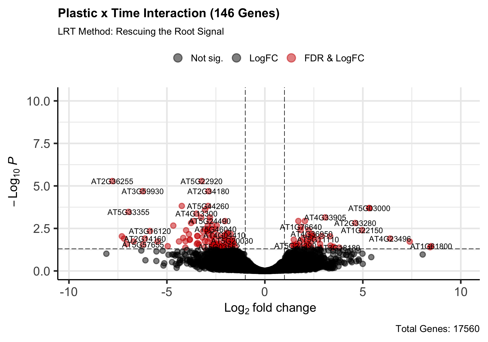
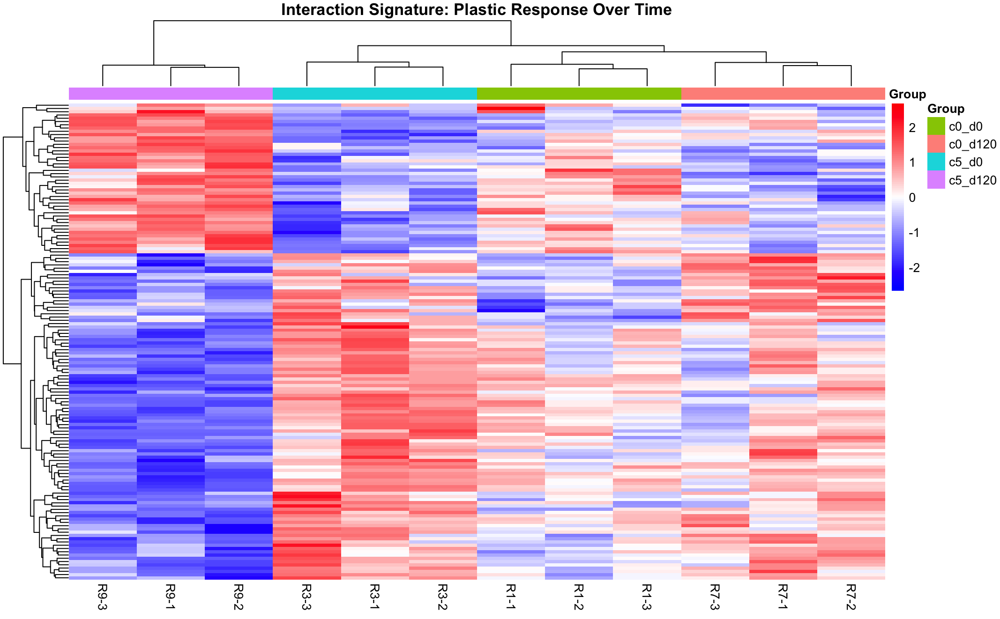

# Phase 2 Visualization: Interaction Signature (Volcano & Heatmap)
**Date:** April 13, 2026
**Project:** Plant-Epigenomics-Lab-Log

## Overview
Generated high-fidelity visualizations to contextualize the results of the Likelihood Ratio Test (LRT). The focus of this visualization phase is the **Plastic x Time Interaction** term, which identified 146 significant Differentially Expressed Genes (DEGs) representing the unique transcriptomic shift caused by prolonged microplastic exposure (Day 120 at 5% concentration).

## 📊 Visual Diagnostics

### 1. Volcano Plot: The Interaction Term
This plot visualizes the statistical significance (-log10 P-value) versus the magnitude of change (Log2 Fold Change) for the interaction contrast. 

* **Design:** Genes passing the strict FDR and LogFC thresholds are highlighted in red.
* **Key Feature:** The plot utilizes `ggrepel` to clearly label the specific `AT` gene identifiers of the most highly significant targets, making it immediately useful for downstream literature review and pathway analysis.

### 2. Expression Signature Heatmap
To understand *how* these 146 interaction genes behave across the experiment, a Z-score scaled heatmap was generated for the four primary condition groups (`c0_d0`, `c0_d120`, `c5_d0`, `c5_d120`).

* **Clustering Analysis:** The hierarchical clustering dendrogram at the top of the heatmap perfectly isolates the `c5_d120` group (purple) into a completely separate clade. 
* **Biological Conclusion:** This visual confirms that prolonged exposure to 5% microplastics fundamentally rewires the root transcriptome. The expression signature of `c5_d120` is completely distinct from normal aging (`c0_d120`) and initial plastic exposure (`c5_d0`).