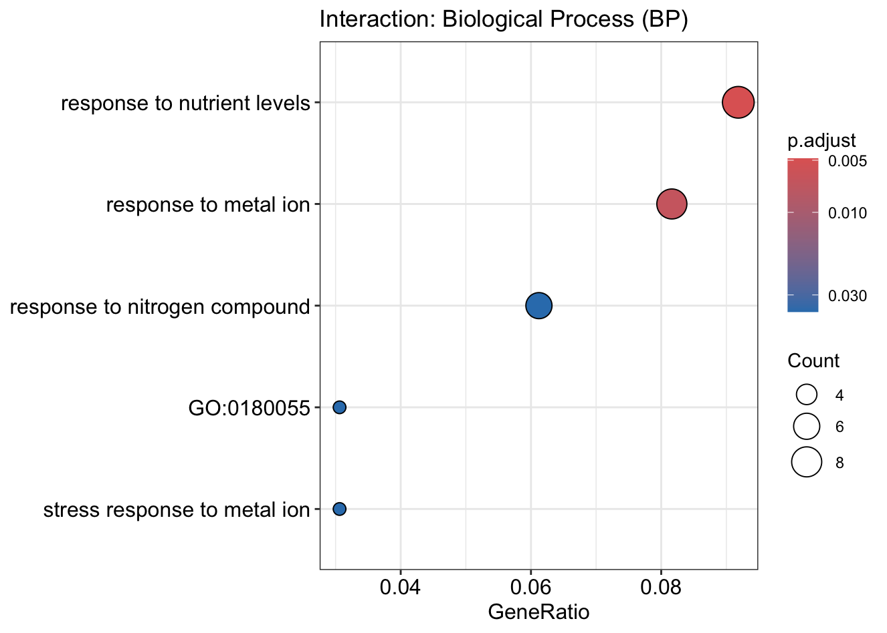
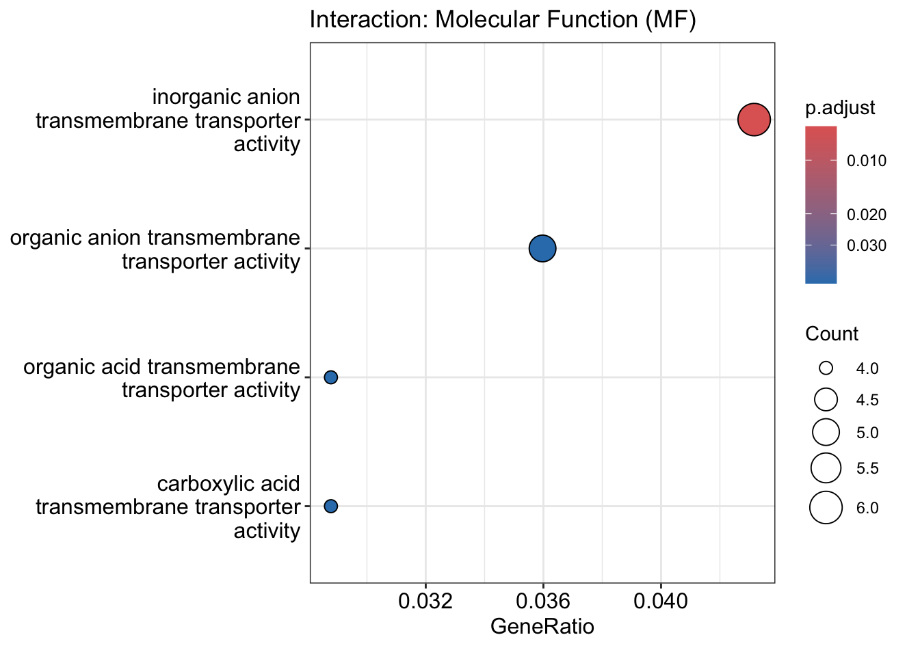
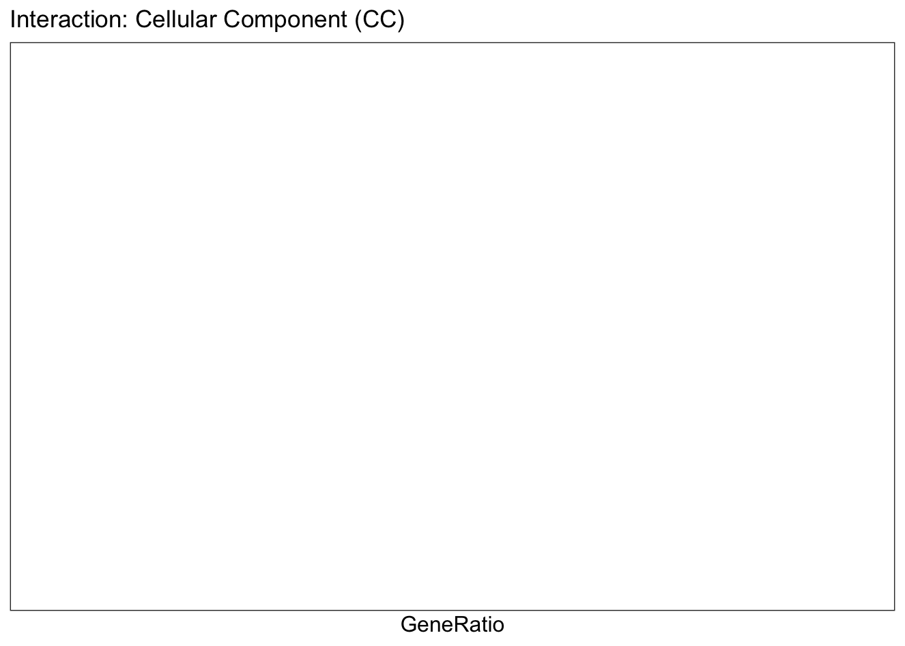
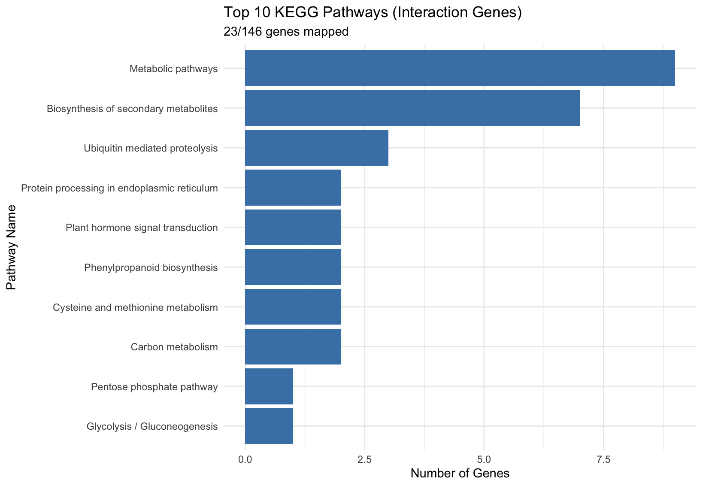
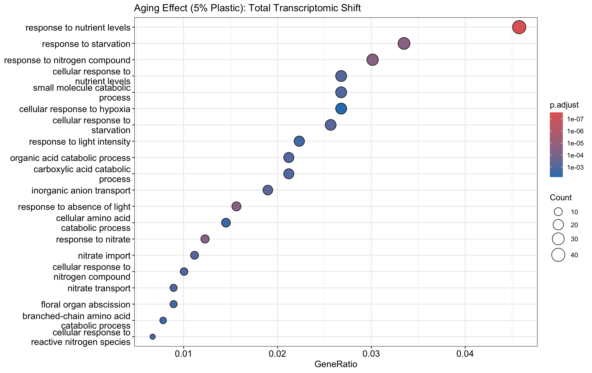

# Phase 2 Functional Enrichment: Interaction & Aging
**Date:** April 13, 2026
**Project:** Plant-Epigenomics-Lab-Log

## Overview
Conducted Gene Ontology (GO) and KEGG pathway enrichment analysis to interpret the biological meaning behind the 146 Plastic x Time Interaction DEGs, as well as the massive 1,240-gene Aging Effect (under 5% Plastic) suite.

## 🛠 Mapping Efficiency
Before enrichment, TAIR IDs were mapped to GO and KEGG databases using `clusterProfiler` (`org.At.tair.db`).
* **GO Mapping Rate:** 139 out of 146 genes (Excellent coverage)
* **KEGG Mapping Rate:** 23 out of 146 genes (Standard for highly specific interaction subsets)

## 📊 Interaction Signature (Plastic x Time)
This evaluates the 146 genes uniquely reacting to prolonged microplastic exposure.

### 1. Gene Ontology (GO)
* **Biological Process (BP):** Significant enrichment for stress responses, specifically to metal ions and nitrogen compounds. 
  
* **Molecular Function (MF):** Strong activation of transmembrane transporter activities (inorganic and organic anions), indicating the roots are actively attempting to pump out or sequester foreign chemical stressors.
  
* **Cellular Component (CC):** *No significant enrichment.* 
  *(Note: The lack of CC enrichment suggests the microplastic interaction response is primarily physiological and metabolic, rather than a restructuring of cellular organelles.)*

### 2. KEGG Pathways
Due to the highly specific nature of the 146-gene interaction term, a custom Top 10 KEGG Pathway bar plot was generated to summarize the metabolic shift.

* **Key Pathways:** The interaction is heavily driving generalized metabolic pathways, biosynthesis of secondary metabolites, and critical plant hormone signal transduction.

---

## 📊 Aging Effect Under 5% Plastic
This evaluates the total transcriptomic shift of the roots aging from Day 0 to Day 120 while submerged in 5% microplastics.

### Gene Ontology: Biological Process (BP)

* **Biological Insight:** Compared to the normal aging process (which only shifted 49 genes), aging under severe microplastic conditioning forced a 1,240-gene shift. The GO terms reflect an environment of extreme deprivation: massive responses to starvation, hypoxia (lack of oxygen), and drastic shifts in nutrient/nitrate transport.